# RudderStack.com Site Map Diagram

**Total pages:** 20,016 across 2 sitemaps  
**Pages crawled:** 77 key pages  
**Internal links discovered:** 2,862  
**CTAs discovered:** 724  

Solid lines = site hierarchy. Dotted lines = internal links/CTAs discovered via crawling.

```mermaid
flowchart LR

  %% === RUDDERSTACK.COM SITE MAP ===
  %% 20,016 total pages from 2 sitemaps
  %% Dotted lines = internal links/CTAs discovered via crawling

  HOME["<b>rudderstack.com</b><br/>Homepage"]

  %% Product Pages
  PRODUCT["<b>Product</b><br/>12 pages"]
  HOME --> PRODUCT
  P_event_stream["Event Stream"]
  PRODUCT --> P_event_stream
  P_data_cloud_cdp["Data Cloud CDP"]
  PRODUCT --> P_data_cloud_cdp
  P_reverse_etl["Reverse ETL"]
  PRODUCT --> P_reverse_etl
  P_profiles["Profiles"]
  PRODUCT --> P_profiles
  P_transformations["Transformations"]
  PRODUCT --> P_transformations
  P_data_governance["Data Governance"]
  PRODUCT --> P_data_governance
  P_data_quality["Data Quality Toolkit"]
  PRODUCT --> P_data_quality
  P_compliance["Compliance Toolkit"]
  PRODUCT --> P_compliance
  P_sdk_identity["SDK Identity Resolution"]
  PRODUCT --> P_sdk_identity
  P_data_apps["Data Apps"]
  PRODUCT --> P_data_apps

  %% Integration Pages (19,186 pages)
  INTEGRATION["<b>Integrations</b><br/>19,186 pages<br/>267 categories"]
  HOME --> INTEGRATION
  INT_podsights["Podsights<br/>87 pages"]
  INTEGRATION --> INT_podsights
  INT_freshmarketer["Freshmarketer<br/>87 pages"]
  INTEGRATION --> INT_freshmarketer
  INT_canny["Canny<br/>87 pages"]
  INTEGRATION --> INT_canny
  INT_new_relic["New Relic<br/>87 pages"]
  INTEGRATION --> INT_new_relic
  INT_appcues["Appcues<br/>87 pages"]
  INTEGRATION --> INT_appcues
  INT_gameball["Gameball<br/>87 pages"]
  INTEGRATION --> INT_gameball
  INT_kubit["Kubit<br/>87 pages"]
  INTEGRATION --> INT_kubit
  INT_bluecore["Bluecore<br/>87 pages"]
  INTEGRATION --> INT_bluecore
  INT_gladly["Gladly<br/>87 pages"]
  INTEGRATION --> INT_gladly
  INT_iterable["Iterable<br/>87 pages"]
  INTEGRATION --> INT_iterable
  INT_ometria["Ometria<br/>87 pages"]
  INTEGRATION --> INT_ometria
  INT_parse_ly["Parse Ly<br/>87 pages"]
  INTEGRATION --> INT_parse_ly
  INT_MORE["...+255 more categories"]
  INTEGRATION --> INT_MORE

  %% Competitor Pages
  COMPETITORS["<b>Competitors</b><br/>41 pages"]
  HOME --> COMPETITORS
  COMP_VS["VS Comparisons<br/>23 pages"]
  COMP_ALT["Alternatives<br/>18 pages"]
  COMPETITORS --> COMP_VS
  COMPETITORS --> COMP_ALT

  BLOG["<b>Blog</b><br/>388 pages"]
  HOME --> BLOG
  BLOG_ENG["Engineering"]
  BLOG_PROD["Product"]
  BLOG_CO["Company"]
  BLOG_POSTS["382 posts"]
  BLOG --> BLOG_ENG
  BLOG --> BLOG_PROD
  BLOG --> BLOG_CO
  BLOG --> BLOG_POSTS

  CUSTOMERS["<b>Customers</b><br/>37 case studies"]
  HOME --> CUSTOMERS

  GUIDES["<b>Guides</b><br/>266 guides"]
  HOME --> GUIDES

  KB["<b>Knowledge Base</b><br/>22 articles"]
  HOME --> KB

  RESOURCES["<b>Resources</b><br/>Resource Center"]
  HOME --> RESOURCES

  %% Core Pages
  PRICING["Pricing"]
  HOME --> PRICING
  ABOUT["About"]
  HOME --> ABOUT
  CAREERS["Careers"]
  HOME --> CAREERS
  CONTACT["Contact"]
  HOME --> CONTACT
  SECURITY["Security"]
  HOME --> SECURITY
  PARTNERS["Partners"]
  HOME --> PARTNERS
  PARTNERSHIPS["Partnerships"]
  HOME --> PARTNERSHIPS
  DEMO["Request Demo"]
  HOME --> DEMO
  ENTERPRISE["Enterprise Quote"]
  HOME --> ENTERPRISE
  INTERACTIVE_DEMO["Interactive Demo"]
  HOME --> INTERACTIVE_DEMO

  %% Legal
  LEGAL["<b>Legal</b>"]
  HOME --> LEGAL
  PRIVACY["Privacy Policy"]
  LEGAL --> PRIVACY
  COOKIE["Cookie Policy"]
  LEGAL --> COOKIE
  MSA["Master Service Agreement"]
  LEGAL --> MSA
  DPA["Data Privacy Addendum"]
  LEGAL --> DPA

  %% Landing Pages
  LANDING["<b>Landing Pages</b>"]
  HOME --> LANDING
  TAG_MGR["Tag Manager Alternative"]
  LANDING --> TAG_MGR
  GA4_REPLACE["Replace GA4 Guide"]
  LANDING --> GA4_REPLACE
  SAVE_MONEY["Do More Spend Less"]
  LANDING --> SAVE_MONEY
  ID_PLAYBOOK["Identity Resolution Playbook"]
  LANDING --> ID_PLAYBOOK
  RT_TRANSFORM["Realtime Transformations"]
  LANDING --> RT_TRANSFORM
  SNOWFLAKE["RudderStack + Snowflake"]
  LANDING --> SNOWFLAKE

  %% =========================================
  %% INTERNAL LINKS & CTAs (dotted lines)
  %% Discovered via crawling 77 key pages
  %% =========================================

  %% CTA Links (amber dotted)
  ABOUT -. "Contact us" .-> CONTACT
  BLOG -. "Contact us" .-> CONTACT
  BLOG -. "Request a demo" .-> DEMO
  CAREERS -. "Contact us" .-> CONTACT
  COMP_ALT -. "🚀 Get a demo" .-> COMP_VS
  COMP_ALT -. "Contact us" .-> CONTACT
  COMP_VS -. "Contact us" .-> CONTACT
  COOKIE -. "Contact us" .-> CONTACT
  CUSTOMERS -. "Contact us" .-> CONTACT
  CUSTOMERS -. "Request a demo" .-> DEMO
  GA4_REPLACE -. "🚀 Get a demo" .-> COMP_VS
  GA4_REPLACE -. "Contact us" .-> CONTACT
  HOME -. "Contact us" .-> CONTACT
  HOME -. "Explore all case studies" .-> CUSTOMERS
  HOME -. "Request a demo" .-> DEMO
  HOME -. "Explore the integration library" .-> INTEGRATION
  HOME -. "Explore the Data Compliance Toolkit" .-> P_compliance
  HOME -. "Explore the Data Quality Toolkit" .-> P_data_quality
  HOME -. "Explore RudderStack Event Stream" .-> P_event_stream
  HOME -. "Explore RudderStack Profiles" .-> P_profiles
  HOME -. "Explore Reverse ETL" .-> P_reverse_etl
  ID_PLAYBOOK -. "🚀 Get a demo" .-> COMP_VS
  ID_PLAYBOOK -. "Contact us" .-> CONTACT
  INTERACTIVE_DEMO -. "🚀 Get a demo" .-> COMP_VS
  INTERACTIVE_DEMO -. "Contact us" .-> CONTACT
  PARTNERS -. "🚀 Get a demo" .-> COMP_VS
  PARTNERS -. "Contact us" .-> CONTACT
  PARTNERSHIPS -. "Contact us" .-> CONTACT
  PRICING -. "Contact us" .-> CONTACT
  PRICING -. "Schedule a demo" .-> DEMO
  PRICING -. "Talk to sales" .-> DEMO
  PRICING -. "Contact Sales" .-> ENTERPRISE
  PRIVACY -. "Contact us" .-> CONTACT
  P_compliance -. "Contact us" .-> CONTACT
  P_compliance -. "Request a demo" .-> DEMO
  P_data_apps -. "🚀 Get a demo" .-> COMP_VS
  P_data_apps -. "Contact us" .-> CONTACT
  P_data_apps -. "Learn more about Profiles" .-> P_profiles
  P_data_cloud_cdp -. "Contact us" .-> CONTACT
  P_data_cloud_cdp -. "Request a demo" .-> DEMO
  P_data_cloud_cdp -. "Explore Event Stream" .-> P_event_stream
  P_data_cloud_cdp -. "Explore Profiles" .-> P_profiles
  P_data_cloud_cdp -. "Explore Reverse ETL" .-> P_reverse_etl
  P_data_governance -. "Contact us" .-> CONTACT
  P_data_governance -. "Request a demo" .-> DEMO
  P_data_governance -. "Explore the toolkit" .-> P_compliance
  P_data_governance -. "Explore the toolkit" .-> P_data_quality
  P_data_quality -. "Contact us" .-> CONTACT
  P_data_quality -. "Request a demo" .-> DEMO
  P_event_stream -. "Contact us" .-> CONTACT
  P_event_stream -. "Request a demo" .-> DEMO
  P_event_stream -. "Explore the integration library" .-> INTEGRATION
  P_event_stream -. "Explore the toolkit" .-> P_compliance
  P_event_stream -. "Explore the toolkit" .-> P_data_quality
  P_profiles -. "Contact us" .-> CONTACT
  P_profiles -. "Request a demo" .-> DEMO
  P_reverse_etl -. "Contact us" .-> CONTACT
  P_reverse_etl -. "Request a demo" .-> DEMO
  P_reverse_etl -. "Explore the integration library" .-> INTEGRATION
  P_reverse_etl -. "Explore the toolkit" .-> P_data_quality
  P_sdk_identity -. "🚀 Get a demo" .-> COMP_VS
  P_sdk_identity -. "Contact us" .-> CONTACT
  P_sdk_identity -. "Request demo" .-> DEMO
  P_transformations -. "Contact us" .-> CONTACT
  P_transformations -. "Request a demo" .-> DEMO
  RESOURCES -. "🚀 Get a demo" .-> COMP_VS
  RESOURCES -. "Contact us" .-> CONTACT
  RT_TRANSFORM -. "🚀 Get a demo" .-> COMP_VS
  RT_TRANSFORM -. "Contact us" .-> CONTACT
  SAVE_MONEY -. "🚀 Get a demo" .-> COMP_VS
  SAVE_MONEY -. "Contact us" .-> CONTACT
  SECURITY -. "Contact us" .-> CONTACT
  SECURITY -. "Request a demo" .-> DEMO
  SNOWFLAKE -. "Contact us" .-> CONTACT
  SNOWFLAKE -. "Request a demo" .-> DEMO
  SNOWFLAKE -. "Explore Event Stream" .-> P_event_stream
  TAG_MGR -. "Contact us" .-> CONTACT

  %% Key Internal Links (purple dotted)
  ABOUT -. "Blog" .-> BLOG
  ABOUT -. "🚀   We’re hiring!" .-> CAREERS
  ABOUT -. "Case studies" .-> CUSTOMERS
  ABOUT -. "Integrations library" .-> INTEGRATION
  ABOUT -. "Partner with us" .-> PARTNERS
  ABOUT -. "Privacy policy" .-> PRIVACY
  ABOUT -. "Data Compliance Toolkit" .-> P_compliance
  ABOUT -. "Customer Data Platform" .-> P_data_cloud_cdp
  ABOUT -. "Data Quality Toolkit" .-> P_data_quality
  ABOUT -. "Event Stream" .-> P_event_stream
  ABOUT -. "Profiles" .-> P_profiles
  ABOUT -. "Reverse ETL" .-> P_reverse_etl
  ABOUT -. "Transformations" .-> P_transformations
  ABOUT -. "Security" .-> SECURITY
  BLOG -. "About" .-> ABOUT
  BLOG -. "🚀   We’re hiring!" .-> CAREERS
  BLOG -. "Case studies" .-> CUSTOMERS
  BLOG -. "Integrations library" .-> INTEGRATION
  BLOG -. "Partner with us" .-> PARTNERS
  BLOG -. "Privacy policy" .-> PRIVACY
  BLOG -. "Data Compliance Toolkit" .-> P_compliance
  BLOG -. "Customer Data Platform" .-> P_data_cloud_cdp
  BLOG -. "Data Quality Toolkit" .-> P_data_quality
  BLOG -. "Event Stream" .-> P_event_stream
  BLOG -. "Profiles" .-> P_profiles
  BLOG -. "Reverse ETL" .-> P_reverse_etl
  BLOG -. "Transformations" .-> P_transformations
  BLOG -. "Security" .-> SECURITY
  CAREERS -. "About" .-> ABOUT
  CAREERS -. "Blog" .-> BLOG
  CAREERS -. "Case studies" .-> CUSTOMERS
  CAREERS -. "Integrations library" .-> INTEGRATION
  CAREERS -. "Partner with us" .-> PARTNERS
  CAREERS -. "Privacy policy" .-> PRIVACY
  CAREERS -. "Data Compliance Toolkit" .-> P_compliance
  CAREERS -. "Customer Data Platform" .-> P_data_cloud_cdp
  CAREERS -. "Data Quality Toolkit" .-> P_data_quality
  CAREERS -. "Event Stream" .-> P_event_stream
  CAREERS -. "Profiles" .-> P_profiles
  CAREERS -. "Reverse ETL" .-> P_reverse_etl
  CAREERS -. "Transformations" .-> P_transformations
  CAREERS -. "Security" .-> SECURITY
  COMP_ALT -. "About" .-> ABOUT
  COMP_ALT -. "Blog" .-> BLOG
  COMP_ALT -. "🚀   We’re hiring!" .-> CAREERS
  COMP_ALT -. "Case studies" .-> CUSTOMERS
  COMP_ALT -. "Integrations library" .-> INTEGRATION
  COMP_ALT -. "Partner with us" .-> PARTNERS
  COMP_ALT -. "Privacy policy" .-> PRIVACY
  COMP_ALT -. "Data Compliance Toolkit" .-> P_compliance
  COMP_ALT -. "Customer Data Platform" .-> P_data_cloud_cdp
  COMP_ALT -. "Data Quality Toolkit" .-> P_data_quality
  COMP_ALT -. "Event Stream" .-> P_event_stream
  COMP_ALT -. "Profiles" .-> P_profiles
  COMP_ALT -. "Reverse ETL" .-> P_reverse_etl
  COMP_ALT -. "Transformations" .-> P_transformations
  COMP_ALT -. "Security" .-> SECURITY
  COMP_VS -. "About" .-> ABOUT
  COMP_VS -. "Blog" .-> BLOG
  COMP_VS -. "🚀   We’re hiring!" .-> CAREERS

  %% Styling
  classDef home fill:#8b5cf6,stroke:#6d28d9,color:#fff,font-weight:bold
  classDef section fill:#1e1b4b,stroke:#4338ca,color:#e0e7ff
  classDef product fill:#1e3a5f,stroke:#3b82f6,color:#bfdbfe
  classDef cta fill:#78350f,stroke:#f59e0b,color:#fef3c7
  classDef legal fill:#1a1a2a,stroke:#555,color:#999
  classDef landing fill:#1a2e1a,stroke:#22c55e,color:#bbf7d0

  class HOME home
  class PRODUCT,INTEGRATION,COMPETITORS,BLOG,CUSTOMERS,GUIDES,KB,RESOURCES section
  class P_event_stream,P_data_cloud_cdp,P_reverse_etl,P_profiles,P_transformations,P_data_governance,P_data_quality,P_compliance,P_sdk_identity,P_data_apps product
  class DEMO,ENTERPRISE,INTERACTIVE_DEMO cta
  class PRIVACY,COOKIE,MSA,DPA,LEGAL legal
  class TAG_MGR,GA4_REPLACE,SAVE_MONEY,ID_PLAYBOOK,RT_TRANSFORM,SNOWFLAKE,LANDING landing
```

---

## Section Breakdown

| Section | Pages | Description |
|---------|-------|-------------|
| /integration/ | 19,186 | Integration destination pages (267 categories) |
| /blog/ | 388 | Blog posts and categories |
| /guides/ | 266 | Technical guides |
| /competitors/ | 41 | Competitor comparison pages |
| /customers/ | 37 | Customer case studies |
| /knowledge-base/ | 22 | Knowledge base articles |
| /product/ | 12 | Product feature pages |
| Other | ~50 | Core pages, legal, landing pages |
